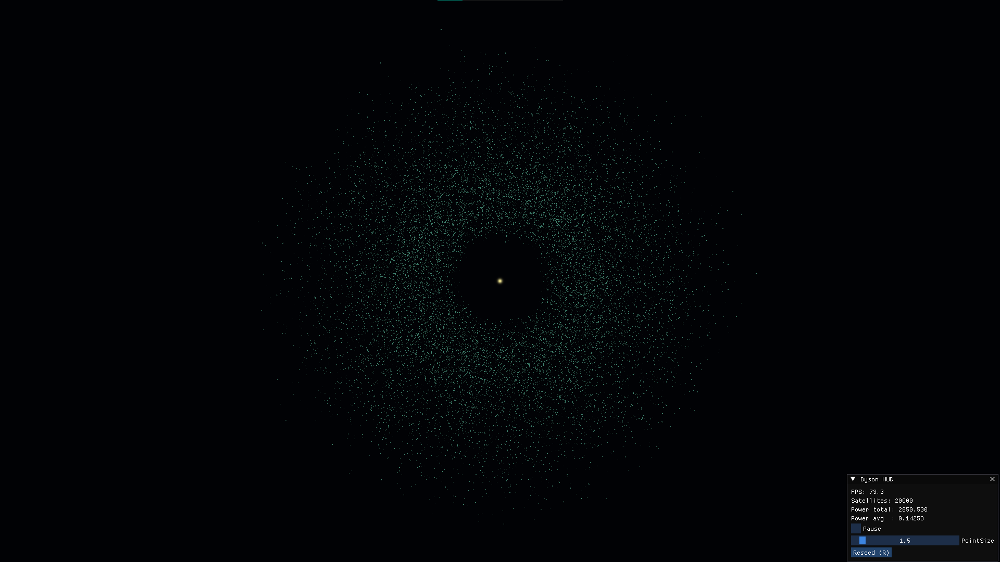
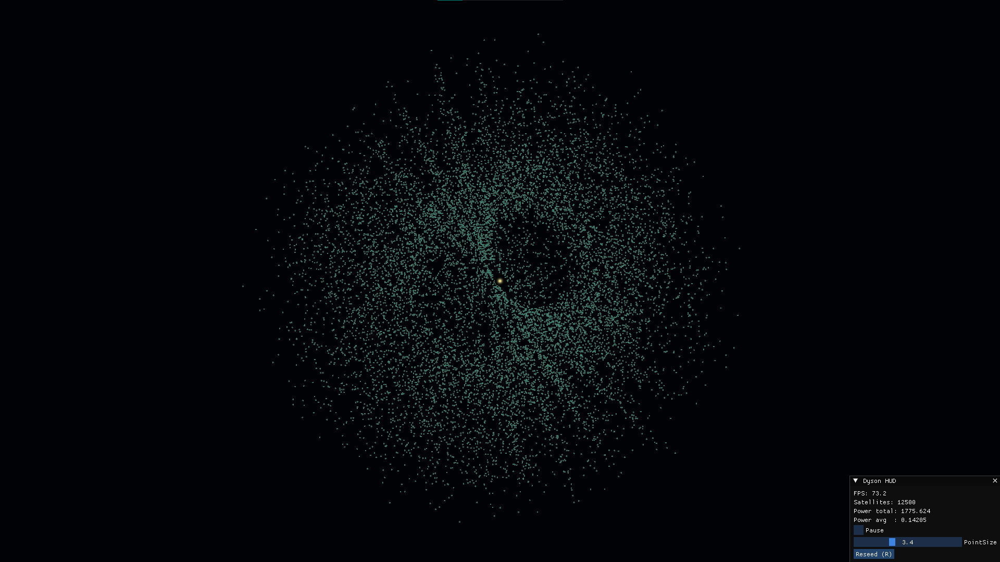

# 🌌 Dyson Swarm Project

  
  
  

##  Description
This project explores the design and development of a **Dyson Swarm**, a theoretical megastructure aimed at capturing and harnessing the full energy output of a star.  
The approach here does not attempt a rigid shell (impossible with current technology), but rather a **fractal modular swarm** of self-replicating collector satellites, capable of scaling in both number and efficiency.

---

##  Objectives
- Capture the largest possible fraction of stellar energy.  
- Modular and scalable design: progressive growth of the swarm.  
- Integration with wireless energy transmission systems (laser, microwave).  
- Preservation of orbital stability and collision avoidance through synchronization protocols.  

---

##  Key Technologies
- **Nanoengineering** → lightweight collectors based on metamaterials.  
- **Autonomous robotics** → self-replicating probes mining asteroids and fabricating new modules.  
- **Fractal computing** → optimization of collector networks following minimum-energy patterns.  
- **Solar propulsion** → lightweight sails for orbital control and maneuvering.  
- **Distributed AI** → swarm management and real-time trajectory resolution.  

---

##  Development Phases
1. **Phase I** — Mining and assembly probes on nearby asteroids.  
2. **Phase II** — First ring of collectors in stable heliocentric orbit.  
3. **Phase III** — Autonomous replication and fractalized swarm expansion.  
4. **Phase IV** — Energy transmission network toward planetary receivers.  
5. **Phase V** — Scaling up until covering most of the stellar output.  

---

##  Risks and Challenges
- Collision control among millions of satellites.  
- Long-term orbital stability.  
- Heat and radiation management.  
- Ethical and strategic implications of monopolizing stellar energy.  

---

##  Future Directions
- Interstellar expansion: swarm replication in neighboring systems.  
- Hybridization with fractal gravitational cores.  
- Potential use as a **stellar engine** (Shkadov thruster).  

---

##  License
This project is theoretical and experimental. Distributed under the **MIT License** for free study and adaptation.  
