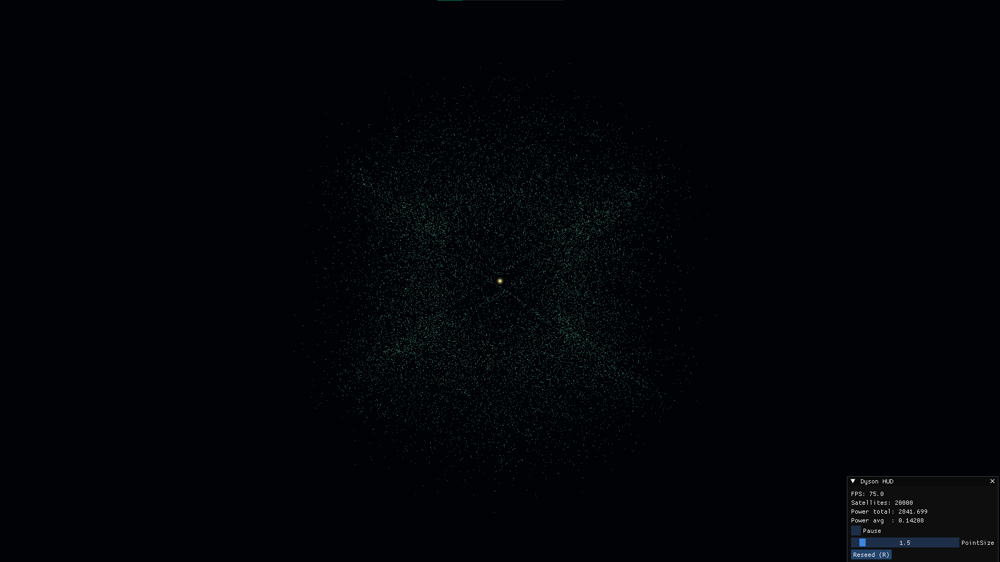
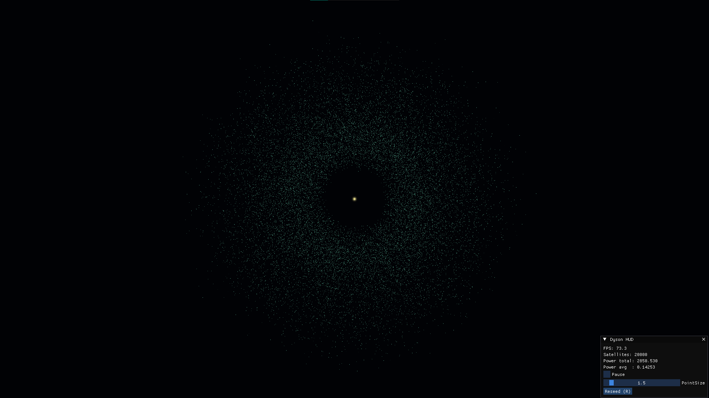
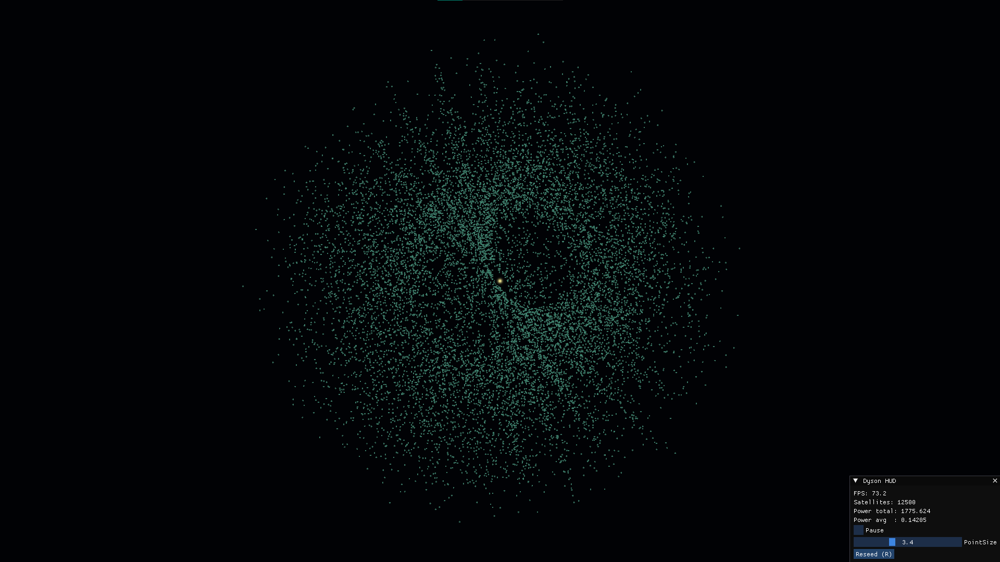

<h1>Dyson Swarm Project</h1>

  
  
  

<h2>Description</h2>

A theoretical <strong>Dyson Swarm simulator</strong> based on a modular network of
collector satellites orbiting a star.

The project explores swarm expansion, orbital coordination, energy collection,
and large-scale autonomous infrastructure.

<h2>Core Concepts</h2>

Modular collector satellites 
Heliocentric orbital simulation 
Swarm coordination 
Collision avoidance 
Stellar energy collection 
Autonomous expansion

<h2>Roadmap</h2>

1. Basic orbital simulation 
2. Collector deployment 
3. Swarm coordination 
4. Energy network 
5. Large-scale expansion

<h2>Future</h2>

Autonomous replication 
Interstellar swarms 
Shkadov thruster concepts

<h2>License</h2>

MIT License.

